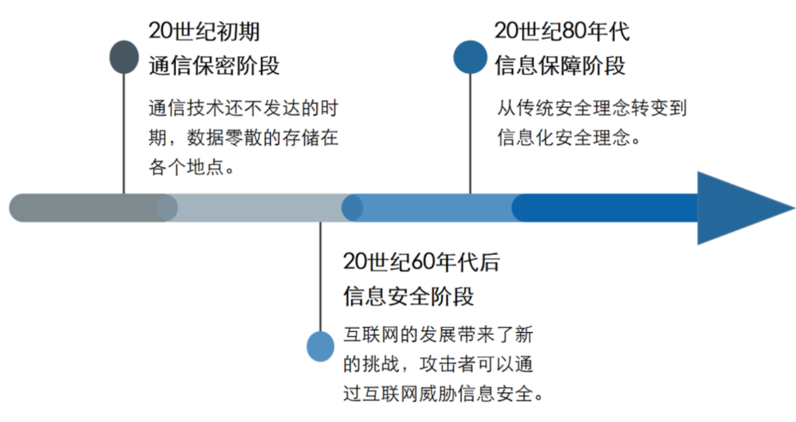
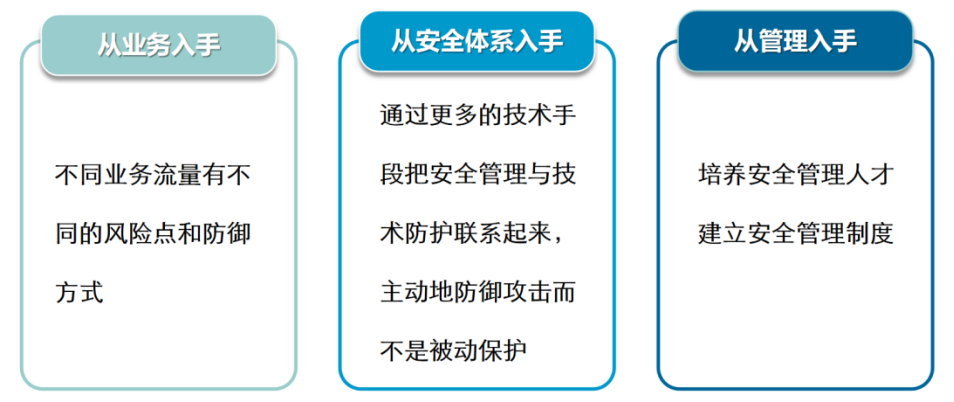
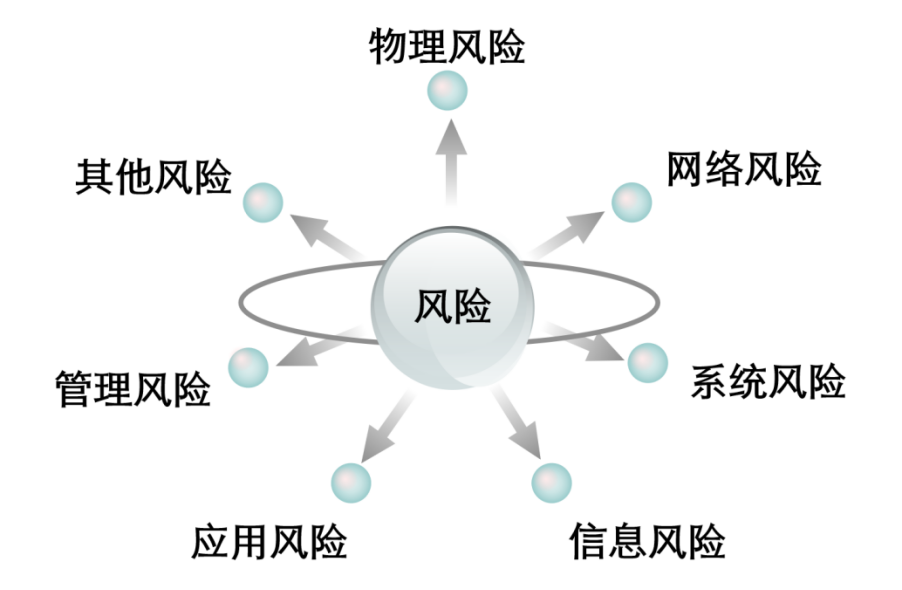

# 信息安全概述

 * 更新时间：20221206

## 简介

　　什么是信息？一般意义上，信息可以理解为消息、信号、数据、情报或知识。它可以以多种形式存在，可以是信息设施中存储与处理的数据、程序；可以是打印或书写出来的论文、电子邮件、设计图纸、业务方案；也可以是显示在胶片等载体或表达在会话中的消息。

　　信息安全又是什么？信息安全也被称为InfoSec）是指通过采用计算机软硬件技术 、网络技术、密钥技术等安全技术和各种组织管理措施，来保护信息在其神秘周期内的产生、传输、交换、处理和存储的各个环节中，信息的机密性、完整性和可用性不被破坏。

　　信息安全的任务，就是要采取措施（技术手段及有效管理）让这些信息资产免遭威胁。

　　信息安全的目的，就是让信息系统（包括硬件、软件、数据、人、物理环境及其基础设施）受到保护，不受偶然的或者恶意的原因而遭到破坏、更改、泄露，系统连续可靠正常地运行，信息服务不中断。

## 信息安全发展历程

**（1）信息保密阶段**

　  在通信保密阶段中通信技术还不发达，数据只是零散地位于不同的地点，信息系统的安全仅限于保证信息的物理安全以及通过密码（主要是序列密码）解决通信安全的保密问题。把信息安置在相对安全的地点，不容许非授权用户接近，就基本可以保证数据的安全性了。

**（2）信息安全阶段**

　　从二十世纪90年代开始，由于互联网技术的飞速发展，信息无论是企业内部还是外部都得到了极大的开放，而由此产生的信息安全问题跨越了时间和空间，信息安全的焦点已经从传统的保密性、完整性和可用性三个原则衍生为诸如可控性、不可否认性等其他的原则和目标。

- 保密性(Confidentiality)：确保信息只能由那些被授权使用的人获取                           

- 完整性(Integrity)：保护信息及其处理方法的准确性和完整性

- 可用性(Availability) ：确保被授权使用人在需要时可以获取信息和使用相关的资产

- 可控性(Controllability)：对信息和信息系统实施安全监控管理，防止非法利用信息和信息系统

- 不可否认性(Non-Repudiation)：防止信息源用户对他发送的信息事后不承认，或者用户接收到信息之后不认帐。

　　信息安全涉及到信息的保密性(Confidentiality)、完整性(Integrity)、可用性(Availability)、可控性(Controllability)和不可否认性(Non-Repudiation)。

　　综合起来说,就是要保障电子信息的有效性。保密性就是对抗对手的被动攻击,保证信息不泄漏给未经授权的人。完整性就是对抗对手主动攻击,防止信息被未经授权的人篡改。可用性就是保证信息及信息系统确实为授权使用者所用。可控性就是对信息及信息系统实施安全监控。

**（3）信息保障阶段**

　　进入面向业务的安全保障阶段，从多角度来考虑信息的安全问题。

## 建设信息安全的意义

* 信息化越重要，信息安全越重要

- 信息网络成为经济繁荣、社会稳定和国家发展的基础。
    - 信息化深刻影响着全球经济的整合国家战略的调整和安全观念的转变
    - 从单纯的技术性问题变成事关国家安全的全球性问题
* 信息安全适用于众多技术领域
    例如：
    - 军事计算机通讯指挥和情报系统
    - 电子商务系统
    - 生物医学系统
    - 智能运输系统

　　信息安全的分类从大的层面上定义了数据的保密性，完整性，可用性，可控性和不可抵赖性。针对于网络安全的层面，考虑的需求分类不一样，还包括一些具体层次的要求，比如物理的安全性，身份鉴别，审计与检测等的要求。

## 信息安全涉及的风险
	

